# MirrorManager2 Sequence Diagrams

This document contains Mermaid UML sequence diagrams showing how the various components of MirrorManager2 interact.

## Table of Contents

1. [UMDL: Master Mirror Scanning](#1-umdl-master-mirror-scanning)
2. [Crawler: Mirror Freshness Checking](#2-crawler-mirror-freshness-checking)
3. [Web App: Mirror Registration](#3-web-app-mirror-registration)
4. [Report Mirror: Private Mirror Check-in](#4-report-mirror-private-mirror-check-in)
5. [Cache Generation & MirrorList Request](#5-cache-generation--mirrorlist-request)
6. [End-to-End: New Content Propagation](#6-end-to-end-new-content-propagation)

---

## 1. UMDL: Master Mirror Scanning

The Update Master Directory List (UMDL) process scans the master mirror filesystem and updates the database with current file information.

```mermaid
sequenceDiagram
    autonumber
    participant Cron
    participant UMDL as mm2_update-master-directory-list
    participant NFS as Master Mirror (NFS)
    participant DB as PostgreSQL Database

    Cron->>UMDL: Execute (every 5 min)
    UMDL->>DB: Load categories & existing directories
    
    loop For each category in UMDL_MASTER_DIRECTORIES
        UMDL->>NFS: Walk directory tree
        NFS-->>UMDL: Return file/dir listing with stats
        
        loop For each directory
            UMDL->>DB: Check Directory.ctime
            
            alt Directory changed (ctime different)
                UMDL->>NFS: Read directory contents
                NFS-->>UMDL: File list with sizes, timestamps
                
                alt >10 files of same type (.rpm, .html, etc)
                    UMDL->>UMDL: short_filelist() - keep 3 newest
                end
                
                UMDL->>DB: Update Directory.files (JSON)
                UMDL->>DB: Update Directory.ctime
                
                alt Contains repodata/repomd.xml
                    UMDL->>NFS: Read repomd.xml checksums
                    UMDL->>DB: Create/Update Repository record
                    UMDL->>DB: Create FileDetail with checksums
                end
            else Directory unchanged
                UMDL->>UMDL: Skip (no update needed)
            end
        end
    end
    
    UMDL->>DB: Remove orphaned directories
    UMDL->>DB: age_file_details() - remove old FileDetail entries
    UMDL-->>Cron: Exit
```

---

## 2. Crawler: Mirror Freshness Checking

The crawler checks if public mirrors have up-to-date content by comparing their files against the database (which reflects master mirror state).

---

## 3. Web App: Mirror Registration

Flow for a mirror administrator registering a new mirror site and host.

---

## 4. Report Mirror: Private Mirror Check-in

Private mirrors use the `report_mirror` client to report their content directly, bypassing the crawler.

---

## 5. Cache Generation & MirrorList Request

This shows how data flows from MirrorManager2 database to end users requesting mirror lists.

---

## 6. End-to-End: New Content Propagation

This shows the complete lifecycle when new content (e.g., a new Fedora release) is published.

---

## 7. Propagation Statistics Collection

This shows how propagation statistics are collected for monitoring mirror sync progress.

---

## Summary: Component Interaction Map

---

## Data Flow Summary Table

| Flow | Trigger | Source | Destination | Data |
|------|---------|--------|-------------|------|
| UMDL Scan | Cron (5 min) | NFS Mount | Database | Directory listings, file checksums |
| Crawler Check | Cron (3x daily) | Database + Mirrors | Database | up2date status per directory |
| Report Mirror | Cron (on mirror) | Private Mirror | Database | File listings via XML-RPC |
| Cache Generation | Cron (hourly) | Database | Protobuf file | All mirror/repo/file data |
| MirrorList Request | User request | Protobuf (RAM) | User | Ordered mirror URL list |
| Web Management | User action | User | Database | Site/Host/Category config |
| Propagation Stats | Cron (hourly) | Mirrors | Database | repomd.xml freshness |

